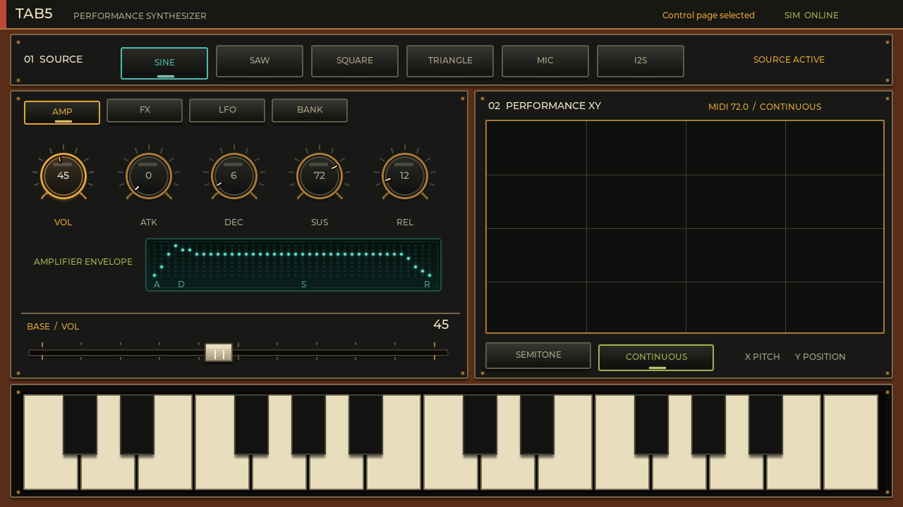
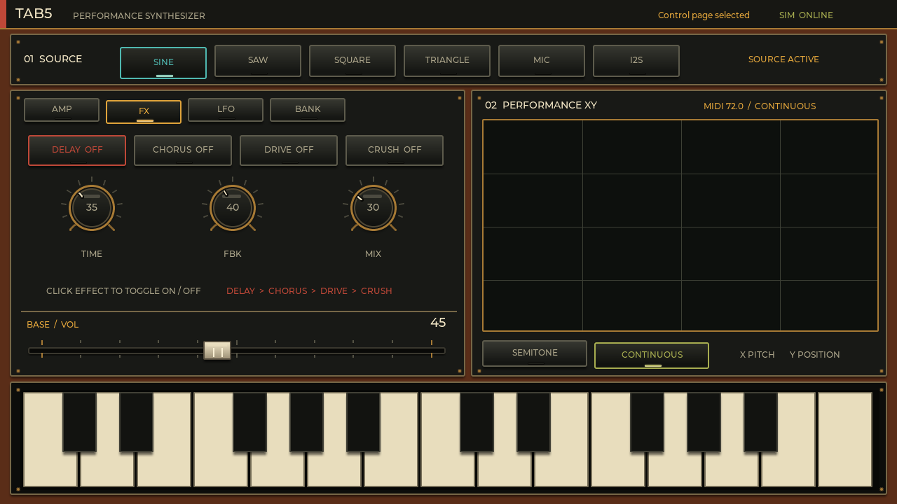
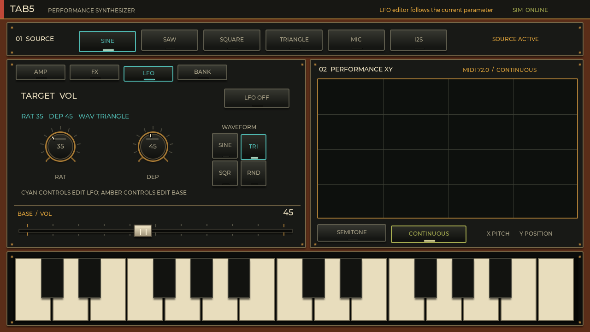
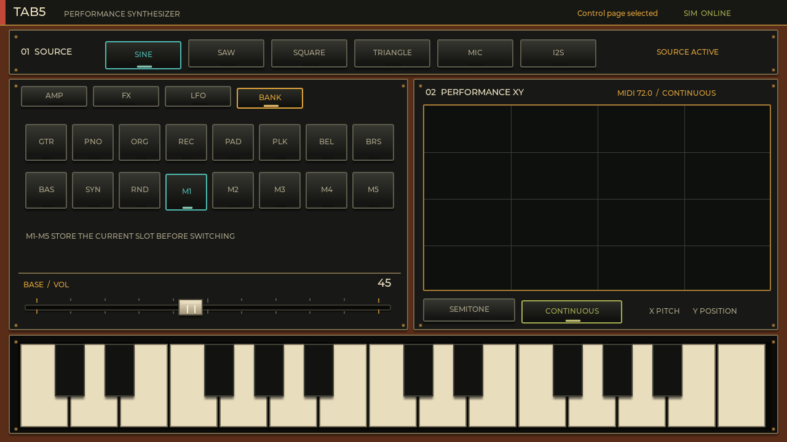

# Tab5 Synth User Manual

[Illustrated HTML manual](https://airpocket-soundman.github.io/Tab5_synth/en/) · [日本語](manual.ja.md) · [中文](manual.zh-CN.md)

Tab5 Synth is an 8-voice touch synthesizer for M5Stack Tab5. It includes four oscillator waves, microphone sampling, external I2S input, an ADSR envelope, four effects, per-parameter LFOs, presets, an XY pad, and a two-octave keyboard.

## Basic workflow

1. Select a source such as `SINE` or `SAW`.
2. Select a parameter on `AMP` or `FX`.
3. Change its 0–100 value with the shared horizontal fader.
4. Play the keyboard or XY pad.

## Sources

| Source | Meaning | Typical uses |
|---|---|---|
| `SINE` | Pure sine wave. “Sing” is a common typo; the UI label is SINE | Sub bass, flute-like tones, soft leads |
| `SAW` | Harmonic-rich sawtooth | Strings, brass, bold leads |
| `SQUARE` | Hollow electronic square wave | 8-bit tones, bass, reed-like sounds |
| `TRIANGLE` | Gentle triangle wave | Bells and soft bass |
| `MIC` | Records while held and samples on release | Voice, percussion, found sound |
| `I2S` | External digital audio input | External sources such as AtomS3 |

Hold `MIC` for at least one second; shorter recordings are discarded. The maximum is five seconds. The web simulator demonstrates the UI, while real recording and audio output require Tab5 hardware.

## AMP and envelope



```text
level
 ^         peak
 |        /\
 |       /  \_________ sustain
 |      /              \
 |_____/________________\____> time
       A   D       S     R
       key down          key up
```

| Parameter | Meaning |
|---|---|
| `VOL` | Overall output level |
| `ATK` | Attack: time from key-down to peak |
| `DEC` | Decay: time from peak to sustain level |
| `SUS` | Sustain: level held while the key is down; this is not a time |
| `REL` | Release: time from key-up to silence |

For a short percussive sound, use fast ATK/DEC and low SUS. For a pad, increase ATK and REL.

## FX



Signal order is `SOURCE → DELAY → CHORUS → DRIVE → CRUSH → OUTPUT`. An effect-name button selects and toggles that effect; parameters remain editable while bypassed.

| FX | Parameter | Meaning |
|---|---|---|
| Delay | `TIME` | Time before the echo |
|  | `FBK` | Feedback and repeat length |
|  | `MIX` | Delayed-signal blend |
| Chorus | `RATE` | Modulation speed |
|  | `DEP` | Modulation depth |
|  | `MIX` | Chorus-signal blend |
| Drive | `DRV` | Distortion strength |
|  | `TON` | Brightness after distortion |
|  | `MIX` | Distorted-signal blend |
| Crush | `BITS` | Quantization roughness |
|  | `RATE` | Sample-update reduction |
|  | `MIX` | Crushed-signal blend |

## LFO



The LFO automatically moves any AMP or FX parameter. All 17 targets independently retain `RAT`, `DEP`, waveform, and on/off state.

1. Select the target parameter on AMP or FX.
2. Open `LFO` and confirm the `TARGET` label.
3. Set `RAT` (speed) and `DEP` (range).
4. Choose `SINE`, `TRIANGLE`, `SQUARE`, or `RND`, then enable `LFO ON`.

Amber controls edit normal base values; cyan controls edit LFO settings. On the LFO page, the shared fader changes the selected LFO field, not the target’s base value.

## BANK



| Buttons | Contents |
|---|---|
| `GTR PNO ORG REC` | Guitar / Piano / Organ / Recorder |
| `PAD PLK BEL` | Pad / Pluck / Bell |
| `BRS BAS SYN` | Brass / Bass / Synth |
| `RND` | Random combination of source, values, and effects |
| `M1`–`M5` | Working memories; the slot being left is saved before the destination loads |

## XY pad and keyboard

- XY X covers MIDI 48–96.
- `SEMITONE` quantizes pitch; `CONTINUOUS` allows smooth pitch.
- Y is forwarded as performance position.
- The bottom keyboard spans about two octaves; white keys are natural notes and black keys are sharps/flats.
- Sliding gestures and up to eight-note chords are supported.

See the [HTML manual](https://airpocket-soundman.github.io/Tab5_synth/en/#simulator) for simulator captures and the interactive LVGL UI.
